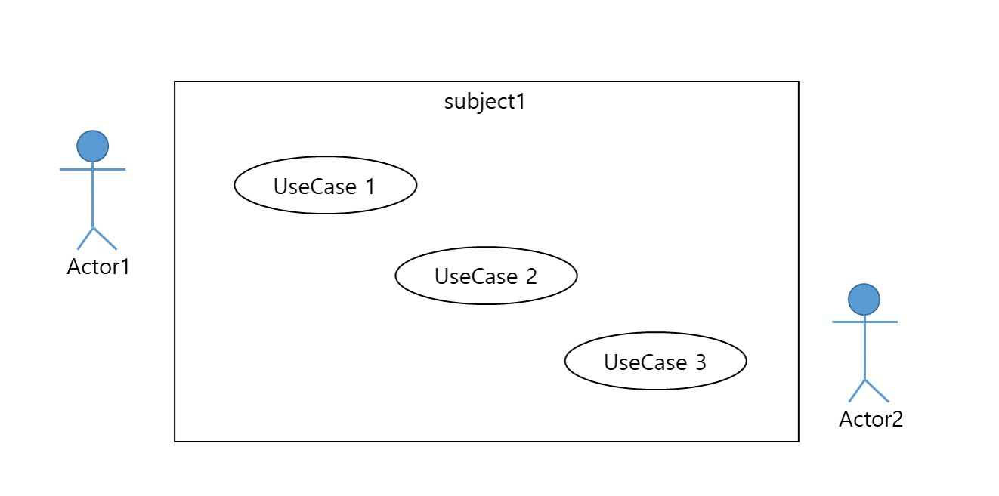
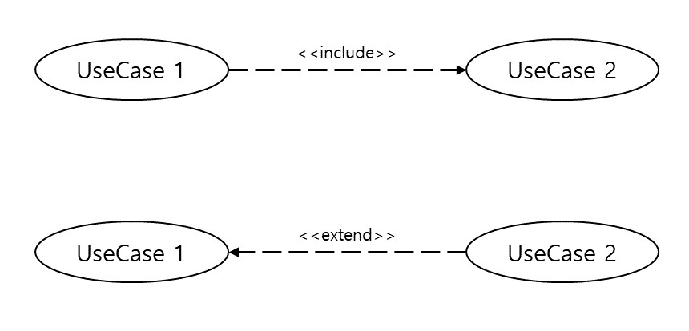
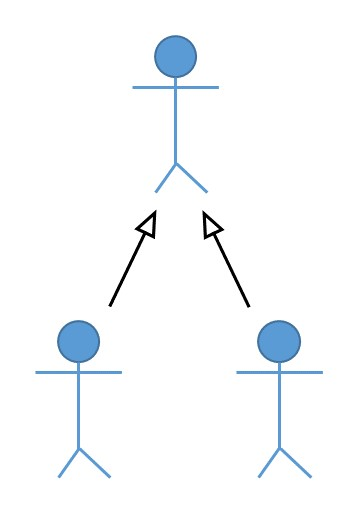
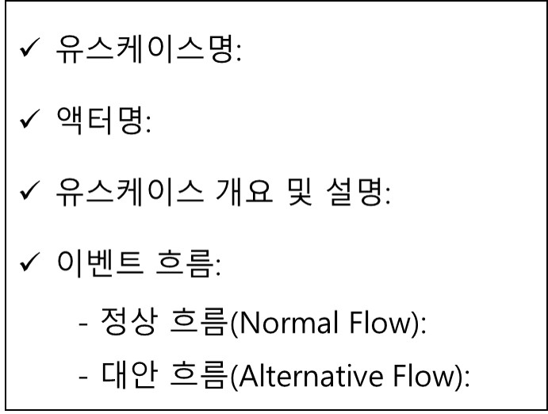

# 유스케이스 모델링과 UML 표기법

* 사용자의 관점을 빨리 이해해야 쓸모 있고 유용한 시스템을 만들 수 있음
- - -

        - 시스템(subject): 사각형으로 표현되며, 경계 내부는 구현해야 하는 시스템의 기능을 표시
        - 액터(Actor): 개발할 시스템 외부의 존재로 이벤트의 흐름을 시작하게 하는 객체
        - 유스케이스(UseCase): 개발할 시스템의 단위 기능
- - -

        - 포함 관계(<<include>>): 여러 유스케이스에서 공통적으로 발견되는 시스템의 기능
                                그림에서 UseCase1이 완료되기 위해서는 만드시 UseCase2를 실행해야 함
        - 확장 관계(<<extend>>): 하나의 유스케이스에서 특정 조건에 의해 실행되는 기능
                                그림에서 UseCase1이 실행되는 도중 필요에 의해 UseCase2를 실행하거나 실행하지 않음
- - -                                
 
        
        - 액터 사이의 일반화: 한 액터가 다른 액터의 일종이다. 한 액터도 다른 액터에 해당된다.
                             ex) 회원과 비회원 모두 고객이다. 고객도 관리자도 사용자이다.
                             유스케이스 다이어그램의 복잡도가 줄어든다.

- - -                             
### 유스케이스 모델링 절차

        1단계: 시스템 상황을 확인 (문제 기술서 작성-유저스토리 같은(Given, When, Then))
        2단계: 액터 식별 (시스템도 액터가 될 수 있음)
        3단계: 유스케이스 식별 (기능 식별)
        4단계: 유스케이스 다이어그램 작성 (관계 설정: 액터-유스케이스, 유스케이스-유스케이스, 등)
        5단계: 유스케이스 명세서 작성
        6단계: 유스케이스 실체화
        
* 유스케이스 명세서 템플릿
