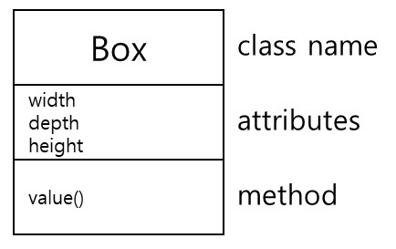

# 클래스 다이어그램
 * 클래스의 구성요소
        
        - 클래스(class): 공통의 속성, 메서드, 관계 의미를 공유하는 개체들의 집합
        - 속성(attributes): 인스턴스가 보유할 수 있는 값의 범위
        - 메서드(method): 이름, 타입, 매개변수들과 연관된 행위를 호출하는데 요구되는 제약사항들을 명세하는 클래스의 행위적 특징
        
 - - -
 * simple class diagram
 

<pre><code>
// class name
 class Box {
  
    // attributes
    private int width;
    private int depth;
    private int hight;
    
    // method name
    public void value() { 
    }
</code></pre>
 - - -
 * 클래스 추출 (명사 추출법)
        
        축구 선수는 골키퍼, 공격수, 미드필더, 수비수로 구성되어 있다.
        골키퍼는 1명이며, 포매이션에 따라 공격수, 미드필더, 수비수의 수가 결정된다. 
        축구는 선수들이 패스, 슛, 태클 등을 통해 공을 상대편 골대에 넣어햐 하는 게임이다.
        
        - 클래스: 축구 선수 (명사)
        - 객체: 골키퍼, 공격수, 미드필터, 수비수 (주로 명사)
        - 메서드: 패스, 슛, 태클 (주로 동사)
- - -
* 클래스 간의 관계

        1) 연관 관계(association) [실선이나 화살표로 표시]: 연관된 클래스 사이에서 어떤 역할을 수행함. 다중성.
        2) 일반화 관계(generalization) [속이 빈 화살표로 표시]: 상속 관계('is a kind of')
        3-1) Aggregation 관계 [속이 빈 다이아몬드로 표시]: 한 객체가 다른 객체를 속성에 포함.(ex) 인자로 받음)
        3-2) Composition 관계 [속이 찬 다이아몬드로 표시]: 한 객체가 다른 객체를 속성으로 생성.
        4) 의존 관계(dependency) [점선 화살표로 표시]: 한 객체가 다른 객체를 잠시 사용하는 관계.
        5) 실체화 관계(realization) [속이 빈 삼각형과 점선으로 표시]: 인터페이스나 추상클래스를 실체화.