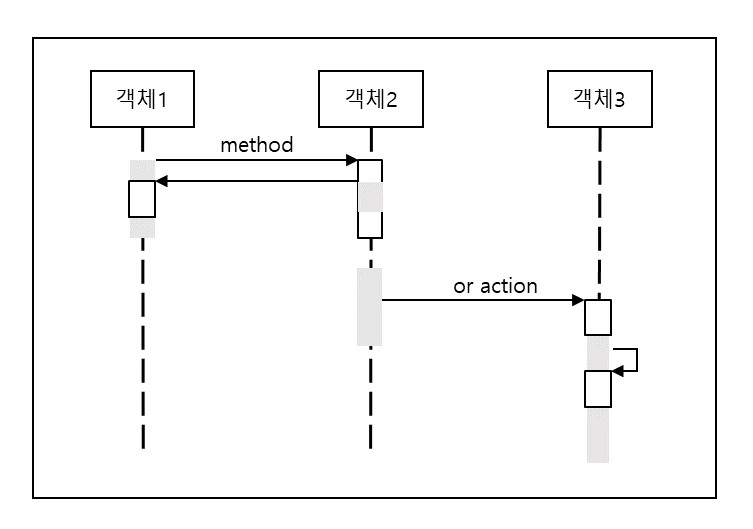

# 순차 다이어그램

* 순차 다이어그램(Sequence Diagram) 

        - 객체간의 동적 상호작용을 시간적 개념을 중심으로 모델링하는 과정
        - 유스케이스를 실현: 객체간의 메시지를 통해 유스케이스의 기능이 실현
        - 구성 요소: 1)액터 2)객체 3)메시지 4)회귀 메시지 5)제어 블록
        
        - 각 유스케이스별 이벤트 흐름을 표현
        - 이미 정의된 클래스를 바탕으로 객체 사이의 상호작용 표현  
        
- - -
* simple sequence diagram

        - 객체에서 아래로 뻗은 점선: 생명선
        - 생명선 중간의 작은 사각형: 활성화(오퍼레이션 수행중을 나타냄)
        - 화살표: 메시지(수신 객체가 오퍼레이션을 실행하도록 요청, 
                        대개 수신 객체가 오퍼레이션을 실행하는 동안 송신 객체 대기) 