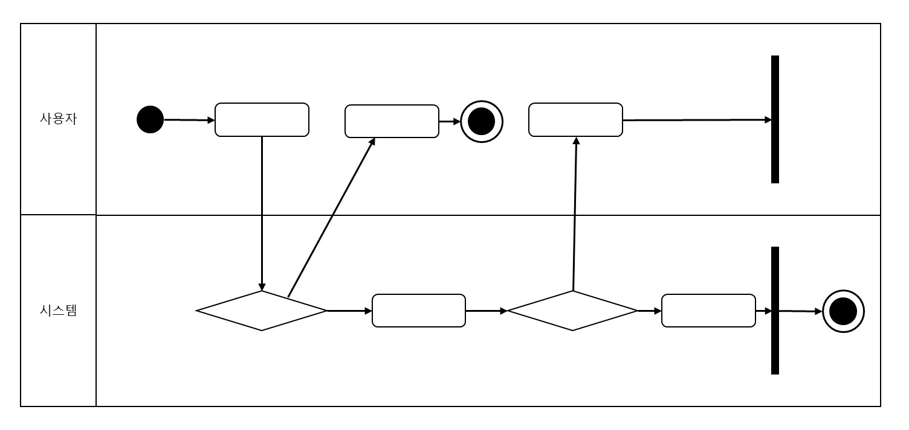

#활동 다이어그램

* 활동 다이어그램의 UML 표기법

        활동 다이어그램은
            - 시작점(검은 동그라미), 종료점(이중 동그라미)
            - 활동 상태 및 전이: 활동상태(둥근 모서리 사각형), 전이(화살표)
            - 분기: 마름모
            - 동기화 막대: 검은 막대
            - 신호: 송신(뾰족한 오각형), 수신(직사각형-송신오각형 모양), 점선으로 연결
            - 구획면: 활동이 이루어지는 액터  
        등 으로 표현됨
        
- - -        
* 활동 다이어그램 활용

        - 유스케이스 명세서에 작성된 흐름을 시각적으로 표현