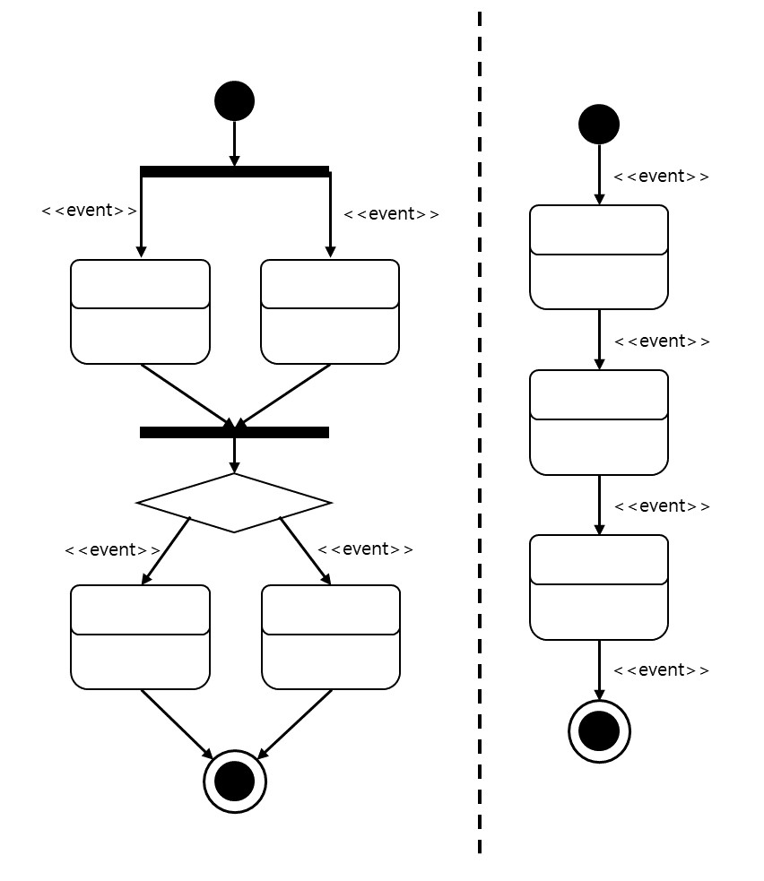

# 상태 다이어그램

* 상태 다이어그램의 UML 표기법

        상태 다이어그램은
            - 시작점(검은 동그라미), 종료점(이중 동그라미)
            - 상태(둥근 모서리 사각형)
            - 이벤트(<<>> 타입 작성), 전이(화살표)
            - 분기(마름모)
            - 동기화 막대(검은 막대)
        로 표현되며, 상태와 이벤트의 확장된 표기법이 존재
        
        상태 다이어그램은 하나의 전이에서 다수의 작업을 진행시키는 '제어의 분리성'이 있으며,
        하나의 상태 안에서 여러 개의 상태를 가질 수 있는 '동시성'이 있다.