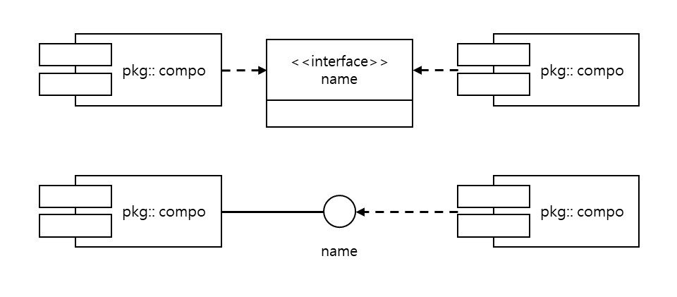

#컴포넌트 다이어그램

* 컴포넌트

        인터페이스에 의해 기능이 정의된 독립적 개발*배포*조립 가능한 시스템의 구성 단위
        메모리에 상주하여 실행되는 코드의 일부분
        
- - -
* 컴포넌트 다이어그램의 구성 요소

        1) 컴포넌트: 탭이 달린 직사각형으로 표현, 모든 컴포넌트는 반드시 이름을 가지고 있어야함.
        2) 인터페이스: 일반적인 사각형 박스로 표현하거나 빈 원으로 표현
        3) 의존관계: 점선 화살표로 표현, 의존관계는 하나의 컴포넌트에 변경이 발생하면 다른 컴포넌트도 영향을 받는 관계
        4) 지원관계
        
- - -
* 컴포넌트와 클래스의 차이점

        1) 클래스는 논리적으로 추상화한 것, 컴포넌트는 물리적인 것.
        2) 컴포넌트가 구현하는 클래스와 컴포넌트의 관계는 의존관계.
        3) 클래스는 속성과 오퍼레이션을 직접 가질 수 있지만, 컴포넌트는 인터페이스를 통해서만 접근할 수 있는 오퍼레이션들만 갖음.
        
- - -
* 컴포넌트 다이어그램 작성 단계

        1) 컴포넌트 대상 정의
        2) 컴포넌트 식별
        3) 컴포넌트 배치
        4) 의존관계 정의
        
- - -
 * 컴포넌트 다이어그램 UML 표현

    
        - 페키지명은 포함되지 않을 수 있으며, 추가적으로 버전이나 메소드명 추가가능
