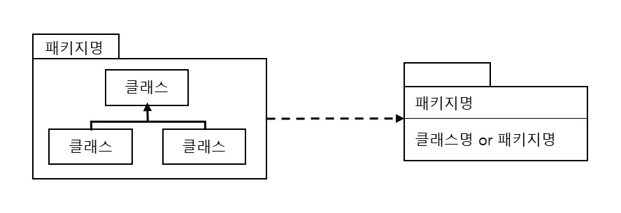

# 패키지 다이어그램

* 패키지 다이어그램

        - 1)패키지 2)의존관계 2가지 요소로 표현
        - 패키지 스테레오타입
            1) <<facade>> : 다른 패키지에 뷰를 제공해주는 패키지
            2) <<framework>> : 주로 패턴으로 구성된 패키지
            3) <<stub>> : 다른 패키지의 공용 내용물에 대한 대리자 역할을 수행하는 패키지
            4) <<subsystem>> : 전체 시스템의 독립된 일부분을 나타내는 패키지
            5) <<system>> : 전체 시스템을 나타내는 패키지
            
        - 의존관계
            의존관계는 점선 화살표로 표현
            - 의존관계 스테레오타입
                1) <<import>> : 패키지의 일부를 자신에게 추가
                2) <<access>> : 패키지가 다른 패키지와 통신하기를 원하지만 실제로 추가하지는 않음
                
        - 패키지 내부에 패키지를 표현할 수 있음
        - 패키지 내부에 클래스를 표현할 수 있음
        - 패키지를 더 상위의 패키지로 합병할 수 있음 